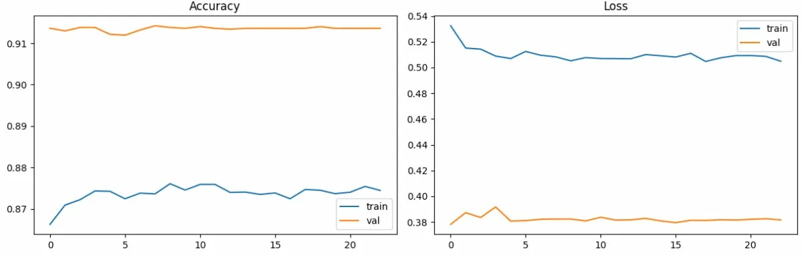
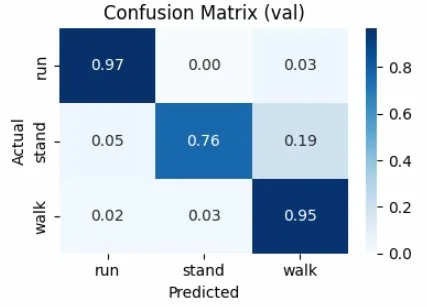
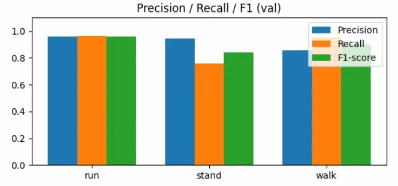

# 🏃 Project_H | 객체(사람) 탐지 및 행동 감지 딥러닝 모델

영상에서 사람을 탐지하고 행동(run / walk / stand)을 인식하는 딥러닝 파이프라인입니다.

##

학습모델 테스트 영상<br>
<br>
[](https://www.youtube.com/watch?v=XI06PPNJSdU&list=PLBjBkI2yDmWm05fRU3HrfWYcSWnsiDlLY&index=1)

---

## 📌 프로젝트 개요

AI 기술을 활용하여 영상속 사람을 탐지하고 행동을 인식하는 딥러닝 모델을 만들어서
여러 산업에 사용하여 다양한 문제에 도움을 주고자 진행한 개인 프로젝트입니다.

| 항목 | 내용 |
|------|------|
| 개발 기간 | 2주 |
| 개발 환경 | Windows / Python 3.10 / CPU |
| 인식 대상 | 사람 (1인 기준) |
| 인식 행동 | run / walk / stand |

---

## 🛠️ 기술 스택

### Language
|   언어   |   용도   |
| -------- | -------- |
|  Python  | AI 기반 영상 분석 및 딥러닝 모델 파이프라인 구현 |

### Tools
| 툴 | 용도 |
|----|------|
| Jupyter Notebook | 데이터 분석 및 모델 학습 |
| Anaconda Prompt | 가상환경 및 패키지 관리 |

### Core
| 라이브러리 | 버전 | 용도 |
|-----------|------|------|
| NumPy | 1.26.4 | 수치 연산 |
| TensorFlow | 2.15.0 | 딥러닝 모델 학습 및 추론 |
| scikit-learn | 1.3.2 | 데이터 전처리 / 라벨 인코딩 |
| MediaPipe | 0.10.9 | 포즈 추출 (33개 관절 키포인트) |
| Ultralytics YOLO | yolo11n | 사람 객체 탐지 및 추적 |
| OpenCV | 4.8.1.78 | 영상 처리 및 시각화 |

### Visualization
| 라이브러리 | 용도 |
|-----------|------|
| Matplotlib | 학습 그래프 시각화 |
| Seaborn | Confusion Matrix 시각화 |

---

## 🏗️ 시스템 아키텍처
```
영상 입력
→ YOLO (사람 탐지 / 바운딩 박스)
→ MediaPipe (포즈 추출 / 33개 관절 × 4차원 = 132 특징)
→ LSTM 모델 (15프레임 시퀀스 → 행동 분류)
→ 결과 영상 출력 (스켈레톤 + 행동 라벨)
```

---

## 📁 프로젝트 구조
```
Project_H/
├── train.ipynb          # 키포인트 추출 + 데이터 증강 + 모델 학습
├── inference.py         # 추론 및 영상 분석
├── finetune.ipynb       # 파인튜닝
├── video/               # 학습용 영상
├── pose_fps/            # 추출된 키포인트 데이터
│   ├── data_pose.npy
│   ├── labels_pose.npy
│   ├── video_ids.npy
│   ├── aug_data.npy
│   ├── aug_labels.npy
│   └── aug_video_ids.npy
└── model/               # 학습모델
    ├── action_model.h5
    └── label_encoder.pkl
```

---

## 🧠 모델 구조
```
Input (15, 132)
→ GaussianNoise (0.05)
→ LSTM (64, return_sequences=True)
→ Dropout (0.5)
→ LSTM (32)
→ Dropout (0.5)
→ Dense (32, relu, L2=0.01)
→ Dropout (0.5)
→ Output (3, softmax)
```

### 파인튜닝 전략 (v3)
```
베이스 모델 (v2) 로드
→ LSTM 레이어 동결 (기존 가중치 보존)
→ Dense 레이어만 재학습
→ 학습률 0.001 → 0.0003으로 낮춰 안정적 파인튜닝
→ 새 데이터 패턴 반영하면서 기존 성능 유지
```
---

## 📊 학습 데이터

| 클래스 | 영상 수 | 프레임 수 |
|--------|---------|----------|
| run | 27개 | 11,762 |
| stand | 23개 | 9,446 |
| walk | 25개 | 7,802 |
| **총계** | **75개** | **29,010** |

### 데이터 증강 기법
- 좌우 반전 (MediaPipe 관절 쌍 기준)
- 랜덤 노이즈 추가
- 스케일 변환 (체형 차이 시뮬레이션)
- 위치 이동 (카메라 위치 차이 시뮬레이션)

---

## 📈 최종 모델 성능 (v3)

<h3>📈 학습 곡선</h3>


<h3>🟦 혼동 행렬</h3>


<h3>📊 막대 그래프</h3>


---

## 🔄 개발 과정 및 개선 이력

### 문제 1 - 과적합
```
현상: train accuracy 99% / val accuracy 60%
원인: 학습/검증 데이터 분포 차이
해결: Dropout 0.3→0.5 / GaussianNoise 0.02→0.05 / L2 정규화 강화
결과: val accuracy 70%대로 향상
```

### 문제 2 - stand 클래스 성능 저조
```
현상: stand → walk 혼동 48%
원인: stand 데이터 다양성 부족
해결: stand 영상 추가 후 파인튜닝 (LSTM 동결 / Dense 재학습)
결과: stand F1 0.65 → 0.89
```

### 문제 3 - run ↔ walk 혼동
```
현상: 보폭이 작아지는 순간 walk로 오인식
원인: 느린 조깅 데이터 부족
해결: 다양한 속도의 run 영상 추가 후 파인튜닝
결과: run F1 0.91 → 0.96
```

### 문제 4 - 모델 구조 개선 시도
```
시도: Transformer 모델로 교체
결과: 현재 데이터 규모에서 LSTM보다 성능 낮음
결론: 데이터 35,000개 수준에서는 LSTM이 더 적합
```

### 한계점 및 개선 방향
```
- 학습 데이터(유튜브)와 실제 환경 간 분포 차이로 일반화 성능 제한
- 직접 촬영 데이터 추가 시 성능 향상 가능
- 다중 인물 환경에서 특정 인물 추적 기능 미구현
```
